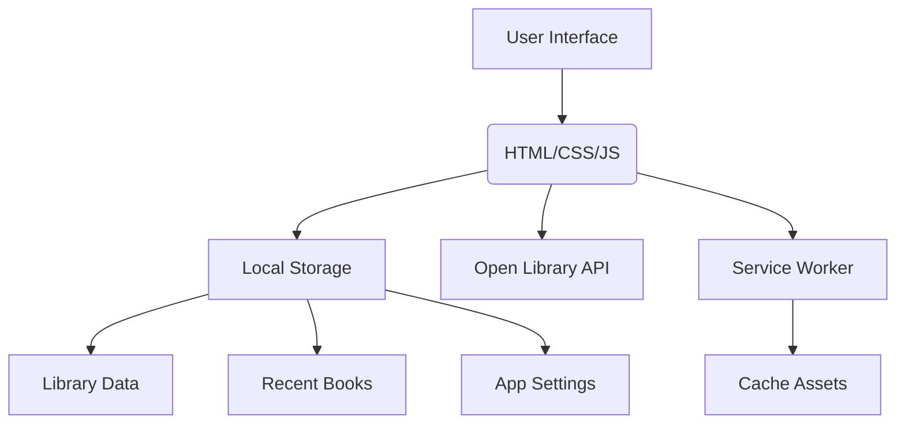

# 📚 BookNest — Your Personal Reading Companion

[](https://developer.mozilla.org/en-US/docs/Web/Progressive_web_apps)
[](https://openlibrary.org/developers/api)
[](LICENSE)

> **A modern, offline-first Progressive Web App to search millions of books, build your reading list, and track your literary journey—all in your browser.**

---

## 📖 Table of Contents

- [Overview](#-overview)
- [Key Features](#-key-features)
- [What Makes BookNest Special](#-what-makes-booknest-special)
- [Architecture](#-architecture)
- [Quick Start](#-quick-start)
- [Built With](#-built-with)


---

## 🎯 Overview

**BookNest** is a progressive web application (PWA) that transforms how you discover, organize, and track your reading habits. It leverages the expansive Open Library API to provide access to millions of books, allowing you to curate a personal digital shelf.

The application is designed with a focus on **privacy**, **performance**, and **offline usability**. Your personal library, ratings, and notes are stored locally in your browser, ensuring your data stays private and accessible anytime.

---

## ✨ Key Features

- **Global Book Search:** Search millions of titles, authors, and keywords using the Open Library API.
- **Personal Library Management:** Save books to your own "Shelf" and organize them into three statuses:
  - 🟣 Want to Read
  - 🔵 Currently Reading
  - 🟢 Finished
- **Private Tracking:** Rate books (1-5 stars) and add personal notes to each entry.
- **Quick Look Panel:** View detailed information (description, subjects) without leaving the main grid.
- **Dual View Options:** Switch between a visual **Grid** view and a text-based **List** view (ideal for offline/low-bandwidth scenarios).
- **PWA Capabilities:**
  - Installable on your device's home screen.
  - Caching for offline access to the app shell and your saved library.
- **Seamless Theme Switching:** Toggle between Light and Dark modes.

---

## 💡 What Makes BookNest Special

- **Offline-First Mindset:** Your library and recent views are stored in `localStorage`, allowing you to access your data even without an internet connection. The **List** view is built to function perfectly without relying on cached cover images.
- **Privacy-Centric:** All your reading data lives exclusively on your device. No cloud accounts or backend servers are involved.
- **Simple & Intuitive:** The interface is designed for a minimal cognitive load, inspired by modern mobile and web app design patterns.


---
# 🚀 Quick Start Guide

This guide will help you set up and run BookNest locally in just a few minutes.

---

## Prerequisites

- A modern web browser (Chrome, Firefox, Edge, Safari).
- A static web server (optional; you can also open the `index.html` file directly in your browser, though some features like service workers may require a server).
- No backend, database, or API keys are required—BookNest runs entirely in your browser.

---

## Installation & Setup

### 1. Clone the Repository

```bash
git clone https://github.com/your-username/booknest.git
cd booknest
```
### 2. Then just open 'index.html' in your browser
---
## 🏗️ Architecture

BookNest application follows a simple, single-page application architecture.



    
